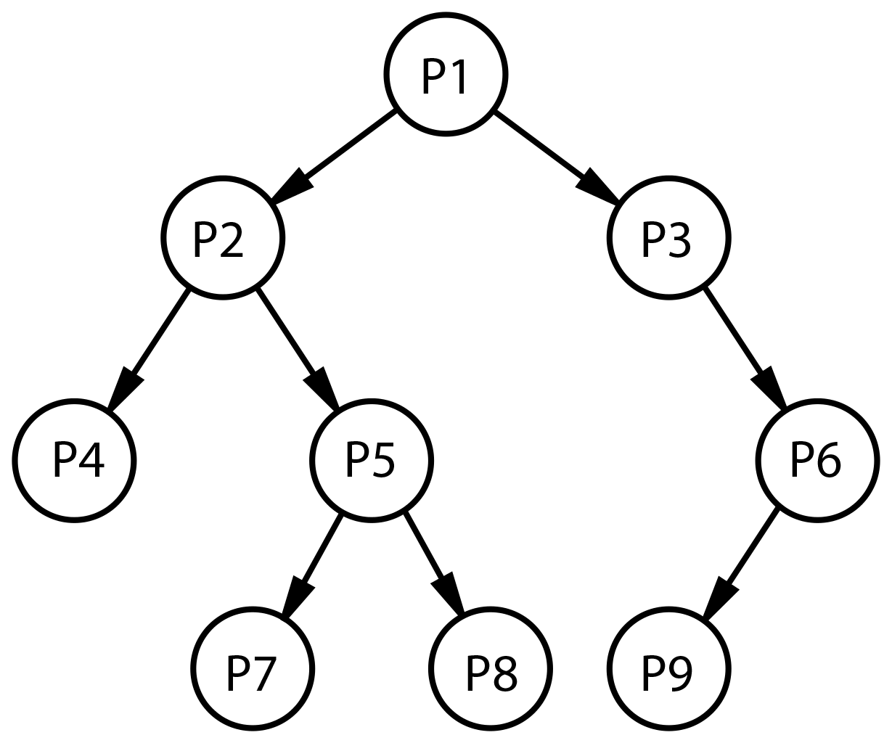

# Multilevel

## Problema 
Se tiene un multinivel de personas, donde cada persona busca dos referidos, entre más referidos tengan sus descendientes, más dinero obtendrá una persona.  El objetivo es crear una empresa multinivel y obtener datos sobre ella:

## Requerimientos

1. Crear un árbol binario de personas, donde cada persona tendrá: nombre, edad y país. Puede ser el del siguiente ejemplo:

2. Con el árbol creado hacer las siguientes funciones:

- Listar personas de un país determinado.
- Promedio de edades.
- Dado el nombre de la persona decir si está o no en el multinivel.
- Si una persona gana 100 dólares por cada descendiente, hallar cuánto gana dado el nombre.
- Dado una persona y un referido, insertarlo en el multinivel.
